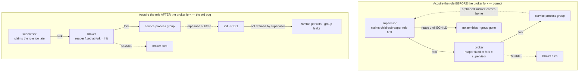

# FreeBSD process reaping

This note explains one FreeBSD-specific detail that shapes how Immortal cleans
up after a crashed process broker: **a process's reaper is chosen when the
process is forked, and it never changes afterwards.** That single rule is why
Immortal must claim its subreaper role *before* it forks the broker, and why
getting the order wrong leaked stray processes only on FreeBSD.

It is written to be read from the top by anyone comfortable with C and Unix
processes; no prior knowledge of subreapers is assumed. A small program at the
end lets you watch the behaviour on a real FreeBSD machine.

## The one-sentence version

On FreeBSD, if the supervisor claims the child-subreaper role *after* forking
the broker, the broker's reaper is permanently `init` (PID 1); when the broker
is killed, its orphaned children are handed to `init` instead of the supervisor,
and the supervisor can no longer clean them up. Claiming the role *before* the
fork makes the supervisor the broker's reaper, so the whole subtree comes home
to the supervisor and is reaped normally.

## Background: orphans, zombies, and reaping

A few plain definitions, because the rest of this note builds on them:

- **Parent / child.** Every process has exactly one parent: the process that
  forked it. `getppid()` returns the current parent's PID.
- **Zombie.** When a process exits, it does not vanish immediately. The kernel
  keeps a small record (the exit status) until the parent collects it. A process
  in this state is a *zombie*.
- **Reaping.** The parent collects that record by calling `wait()` /
  `waitpid()`. This is called *reaping* the child. Until someone reaps it, the
  zombie occupies a process-table slot and still counts as a member of its
  process group.
- **Orphan.** If a parent exits before its child, the child is an *orphan*. The
  kernel must give it a new parent, because a running process always needs one.
- **Reaper.** The process an orphan is re-homed to is its *reaper*. Classically
  this is `init` (PID 1), which reaps whatever lands on it.

The problem Immortal cares about: when a supervised service double-forks or
otherwise scatters descendants, and then something dies unexpectedly, those
descendants must not leak as permanent zombies. Somebody has to be their reaper.

## Subreapers: becoming the reaper for your subtree

A **subreaper** is a process that asks the kernel, "for orphans that appear
below me in the process tree, make *me* the reaper instead of `init`." A
long-running supervisor uses this so a crashed service's stray grandchildren
reparent to the supervisor, which reaps them, instead of leaking to `init`.

The three platforms Immortal targets expose this idea differently, and the
difference is the whole story:

| Platform | How a process asks to be a subreaper | When an orphan's reaper is decided |
|---|---|---|
| Linux | `prctl(PR_SET_CHILD_SUBREAPER, 1)` | **Dynamically.** At the moment a process is orphaned, the kernel walks *up* the ancestor chain and picks the nearest living subreaper (or `init`). |
| FreeBSD | `procctl(P_PID, pid, PROC_REAP_ACQUIRE, NULL)` | **At fork time.** A process's reaper is set when it is forked and is then fixed. Acquiring the role later does *not* re-home children that already exist. |
| macOS | no subreaper API at all | `launchd` reparents and reaps orphans. |

Read the FreeBSD row again: **at fork time, fixed.** On Linux the ordering of
"acquire the role" versus "fork the child" does not matter, because the reaper
is resolved later by walking ancestors. On FreeBSD the ordering is everything.

## Immortal's nested reapers

Immortal supervises services through a dedicated **process broker** (see
[DESIGN.md](DESIGN.md) for why the broker exists). Two processes claim the
subreaper role, for two different jobs:

- **Broker — primary reaper (while it is alive).** The broker is the direct
  parent of every service. It claims the subreaper role so that if a service
  double-forks and its intermediate parent exits, the escaped grandchild
  reparents to the *broker* and is reaped as hygiene, rather than leaking to
  `init`.
- **Supervisor — backup reaper (for when the broker dies).** The broker's role
  dies with the broker. If the broker is force-killed, its entire subtree is
  suddenly orphaned. We want that subtree to come home to the *supervisor*,
  which drains it. So the supervisor also claims the subreaper role.

The subreaper role is **not inherited across `fork`**, so the broker and the
supervisor each acquire it independently.

Here is the sequence on FreeBSD when the broker is force-killed, with the role
acquired in the correct order versus the old, buggy order:



The key node is the broker's reaper. When the broker exits, FreeBSD hands the
broker's children to *the broker's own reaper*. That is the supervisor only if
the supervisor already held the role when it forked the broker.

## Why the ordering silently broke only FreeBSD

The old code claimed the supervisor's subreaper role in the parent branch
*after* `fork()` returned. On Linux and macOS this was harmless:

- **Linux** resolves an orphan's reaper by walking ancestors at orphan time, so
  a slightly late acquire is picked up anyway, and `init` reaps orphans
  regardless.
- **macOS** has no subreaper role; `launchd` reparents and reaps. The acquire is
  a no-op either way.

On **FreeBSD** the broker's reaper was already locked to `init` by the time the
role was acquired. While the broker was alive nothing looked wrong. But when the
broker was force-killed, its orphaned service subtree was handed to `init`
instead of the supervisor. The supervisor only reaps what reparents to *it*, so
those processes fell outside its drain loop. In testing under CPU load the
killed service then remained an unreaped zombie, and because a zombie still
counts as a member of its process group, the group never disappeared and the
broker-death containment check timed out. The leak reproduced roughly one run in
a hundred — only under load — which is exactly the kind of race that passes
locally and fails in CI.

The fix is a one-line move: acquire the supervisor's subreaper role **before**
`fork::fork_process()` creates the broker. Then the broker's reaper is the
supervisor, the orphaned subtree comes home, and it is drained to `ECHILD`
during teardown. On Linux and macOS the move changes nothing.

## See it for yourself

This small program isolates the rule. It forks a "broker" and prints the
broker's reaper, first with the role acquired **before** the fork and then
**after**. It uses `procctl(PROC_REAP_STATUS)` to read the reaper directly, so
the result does not depend on any timing.

```c
/* reaporder.c — show that a FreeBSD process's reaper is fixed at fork time.
 * Build: cc -O2 -o reaporder reaporder.c
 * Run:   ./reaporder before   (the fix)
 *        ./reaporder after     (the old bug) */
#include <sys/procctl.h>
#include <sys/wait.h>
#include <unistd.h>
#include <stdio.h>
#include <string.h>

static pid_t reaper_of_self(void) {
    struct procctl_reaper_status s;
    memset(&s, 0, sizeof s);
    procctl(P_PID, 0, PROC_REAP_STATUS, &s);
    return s.rs_reaper;
}

int main(int argc, char **argv) {
    int before = argc > 1 && strcmp(argv[1], "before") == 0;
    printf("supervisor pid = %d\n", getpid());
    fflush(stdout);

    if (before)                                    /* the fix */
        procctl(P_PID, 0, PROC_REAP_ACQUIRE, NULL);

    pid_t broker = fork();
    if (broker == 0) {
        usleep(100000);                            /* let a late acquire run first */
        pid_t r = reaper_of_self();
        printf("broker reaper = %d (%s)\n", r,
               r == getppid() ? "supervisor: contained"
                              : "init: leaks on FreeBSD");
        fflush(stdout);                            /* _exit does not flush stdio */
        _exit(0);
    }

    if (!before)                                   /* the bug: too late on FreeBSD */
        procctl(P_PID, 0, PROC_REAP_ACQUIRE, NULL);

    waitpid(broker, NULL, 0);
    return 0;
}
```

Build and run it on a FreeBSD host:

```sh
cc -O2 -o reaporder reaporder.c
./reaporder before
./reaporder after
```

Expected output (PIDs will differ):

```text
$ ./reaporder before
supervisor pid = 27115
broker reaper = 27115 (supervisor: contained)
$ ./reaporder after
supervisor pid = 27117
broker reaper = 1 (init: leaks on FreeBSD)
```

In `before`, the broker's reaper is the supervisor's own PID: a killed broker's
subtree would come home and be reaped. In `after`, the broker's reaper is `1`
(`init`): the same subtree would leave the supervisor's control. This program
only *reveals* the reaper; the real leak appears when a killed broker's orphaned
service, handed to `init`, is left as a zombie holding its process group. It
does not build on Linux or macOS, which have no `procctl` reaper interface.

## Where this lives in the code

- `crates/immortal-core/src/process/subreaper.rs` — the cross-platform
  subreaper boundary and the FreeBSD implementation. Its documentation records
  that a late acquire does not re-home existing children.
- `crates/immortal-core/src/process/broker/launch.rs` — acquires the
  supervisor's role **before** the broker fork, and the broker's own role in the
  child branch.
- `crates/immortal-core/src/executor/broker.rs` — the teardown drain that reaps
  the broker's orphaned subtree to `ECHILD`.
- `crates/immortal-core/tests/broker_death_contract.rs` — the contract test that
  kills the broker and asserts the service process group disappears.

## Further reading

- [DESIGN.md](DESIGN.md) — process broker architecture, ownership boundaries,
  and the process-group containment model that the reapers complement.
- FreeBSD manual pages `procctl(2)` (`PROC_REAP_ACQUIRE`, `PROC_REAP_STATUS`)
  and `wait(2)`.
- Linux manual page `prctl(2)` (`PR_SET_CHILD_SUBREAPER`) for the contrasting
  dynamic model.
