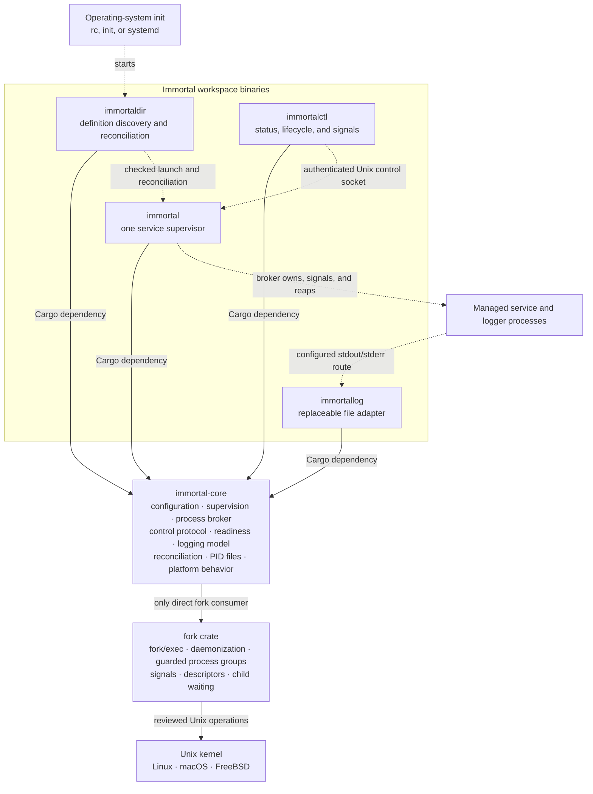
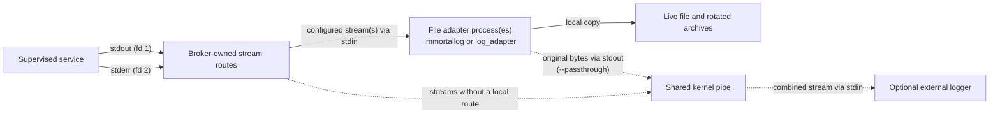

# immortal

Immortal is a focused Unix process supervisor for Linux, macOS, and FreeBSD. It
does not replace the host init system or run as PID 1. The host starts
`immortaldir`; Immortal then reconciles service definitions and owns each
configured application process group.

```text
OS init (PID 1)
    `-- immortaldir
          |-- immortal: api ---- supervised process group
          |                       `-- supervised logger pipeline
          |-- immortal: worker
          `-- immortal: database

immortalctl -------- authenticated local control --------> immortal
```

> [!IMPORTANT]
> The Rust rewrite is a release candidate, not a drop-in replacement for the Go
> release and not yet declared production-ready. Release claims require the
> retained evidence in [VALIDATION.md](VALIDATION.md) and [RELEASE.md](RELEASE.md).

The Go implementation remains on `master` and `develop` as a read-only
requirements reference. Rust accepts only strict `version: 2` definitions and
uses a new bounded control protocol.

## Quick start

Build and validate inside the repository DevPod:

```sh
scripts/dev-up
scripts/dev-ssh cargo build --workspace --locked
scripts/dev-ssh cargo run --quiet --locked -p immortal -- \
  --config examples/services/sleep.yml --check-config
scripts/dev-ssh cargo run --quiet --locked -p immortaldir -- \
  --once --dry-run examples/services
```

Run the example supervisor in one terminal and inspect it from another:

```sh
scripts/dev-ssh examples/run-immortal.sh
scripts/dev-ssh examples/run-immortalctl.sh
scripts/dev-ssh examples/run-immortalctl.sh halt sleep
```

See [INSTALL.md](INSTALL.md) for source installation, init-system integration,
definition migration, and rollback.

## Documentation map

| Document | Purpose |
|---|---|
| [README.md](README.md) | Operator overview, configuration, logging, runtime, and CLI contracts |
| [INSTALL.md](INSTALL.md) | Installation, init integration, migration, and rollback |
| [DESIGN.md](DESIGN.md) | Architecture, ownership boundaries, and process-safety rationale |
| [TRACEABILITY.md](TRACEABILITY.md) | Public contract to automated test mapping |
| [VALIDATION.md](VALIDATION.md) | Correctness, resilience, performance, and platform evidence |
| [RELEASE.md](RELEASE.md) | Release-candidate gates and procedure |
| [AGENTS.md](AGENTS.md) | Mandatory contributor and coding-agent rules |
| [FreeBSD.md](FreeBSD.md) | FreeBSD process-reaping model, nested reapers, and a runnable reproducer |

## Safety model

- The process broker remains the direct parent and sole reaper of managed
  children, and where the platform supports it also reaps descendants orphaned
  inside its subtree so they never leak to init. If the broker is force-killed,
  the supervisor acts as a backing reaper for the orphaned subtree; on FreeBSD
  this requires acquiring the role before forking the broker (see
  [FreeBSD.md](FreeBSD.md)). Tokio starts only after required fork and
  daemonization boundaries.
- A service generation is identified by a monotonic generation, never by a PID
  file or signal-0 probe.
- Each foreground generation owns a process group; lifecycle cleanup targets the
  owned group and broker loss triggers bounded containment.
- PID files are observation-only metadata.
- Foreground execution is preferred. Self-daemonizing software requires explicit
  descriptor tracking and lifecycle hooks; numeric PID adoption is unsupported.
- Logger processes are supervised independently over broker-owned pipes with
  lossless kernel backpressure.
- Control uses a bounded, versioned, authenticated Unix-socket protocol.
- Filesystem notifications are hints; complete reconciliation scans remain
  authoritative.

Detailed process-broker, ownership, containment, and module invariants live in
[DESIGN.md](DESIGN.md). Their automated coverage is indexed in
[TRACEABILITY.md](TRACEABILITY.md).

## Components and architecture

- `immortal-core`: reusable configuration, process, supervision, logging,
  control-protocol, reconciliation, and platform behavior.
- `immortal`: daemonize and supervise one service.
- `immortalctl`: inspect supervisors, change desired state, and deliver signals.
- `immortaldir`: reconcile a directory of service definitions.
- `immortallog`: minimal, replaceable stdin-to-file adapter with bounded-memory
  streaming, rotation, retention, timestamps, optional raw byte pass-through,
  and archive inspection.



Solid arrows are Rust/Cargo dependencies. Dashed arrows are runtime
relationships. CLI crates never call `fork` directly: all process behavior
crosses the `immortal-core::process` boundary.

### CLI organization

Every executable uses the same per-action flow:

```text
src/bin/<name>.rs
  -> cli::start
      -> commands
      -> dispatch
      -> actions::Action
  -> exhaustive Action match
      -> actions::<operation>::execute
      -> immortal-core
  -> shared completion and exit mapping
```

| Layer | Responsibility |
|---|---|
| `commands` | Define Clap syntax, defaults, conflicts, and help text |
| `dispatch` | Convert parsed matches into the typed `actions::Action` contract |
| `actions/mod.rs` | Own `Action`, shared action inputs, and typed action errors |
| `actions/<operation>.rs` | Execute one user-visible operation with typed inputs |
| `src/bin/<name>.rs` | Exhaustively route each action and preserve its exit class |
| `immortal-core` | Own reusable process, protocol, logging, and supervision behavior |

`commands`, `dispatch`, and `start` remain private implementation modules.
Keeping one action per file makes a CLI path easy to trace and lets dispatch,
handler, and black-box routing tests cover separate boundaries. The exhaustive
match belongs in the named binary rather than a central `actions::execute`
function, so adding an action fails to compile until its executable route is
wired.

Entrypoints stay synchronous. An action may create a Tokio runtime only after
the required daemon, broker, signal, and descriptor setup. Binary matches remain
declarative and contain no configuration parsing, runtime construction,
transport, process, logging, or supervision policy.

Every executable's `--version` output includes the shared package version and
the full source commit, for example `immortal 0.1.0 - 446209f...`. Builds made
without Git metadata report `unknown` instead of failing. The build script
watches the active Git HEAD and symbolic ref, including linked-worktree common
metadata, so an incremental build cannot retain a revision from an earlier
commit. The short `-V` form prints only the executable name and package version,
such as `immortal 0.1.0`.

## Compatibility and upgrade policy

The Rust rewrite is a new major generation, not a drop-in replacement for the
Go release. It accepts one configuration schema only: the strict document with
`version: 2`. Unversioned Go YAML and every other version fail validation; there
is no runtime migration or compatibility parser. Operators must deliberately
rewrite and validate definitions before upgrading.

Selected Go CLI spellings remain aliases where they are unambiguous and safe.
This convenience does not imply configuration, control-protocol, process, or
behavioral compatibility. Intentional changes are documented and tested.

The evidence required for resilience, comparative performance, and release
claims is tracked in [VALIDATION.md](VALIDATION.md). A checked implementation
item is not by itself production or superiority evidence.

| Contract | Rust policy |
|---|---|
| Go CLI spellings | Preserve only unambiguous operational aliases; reject removed behavior |
| Unversioned Go `.yml` definitions | Reject; rewrite explicitly as `version: 2` |
| Runtime paths and service names | Use platform-native system roots plus `$HOME/.immortal`; validate ownership |
| PID output files | Preserve as output-only metadata |
| Go `pid.follow` configuration | Reject; use explicit descriptor tracking and lifecycle hooks documented in the [migration guide](INSTALL.md#definition-migration) |
| HTTP-over-Unix-socket control | Replace with a bounded versioned protocol |
| Go status JSON | Preserve equivalent information in `immortalctl --output json` |
| Exact internal Go architecture | Do not preserve |

The [definition migration guide](INSTALL.md#definition-migration) maps the
historical fields to their v2 decisions and explains why numeric PID adoption
cannot preserve the new ownership guarantees. In particular, a PID-file value
does not prove which generation created it and may name an unrelated process
after PID reuse; foreground ownership or an inherited lifetime descriptor does.

`immortalctl` output consumers must account for the explicit discovery scope:
the table begins with `SCOPE`, and JSON records include a `scope` field. This
removes unsafe implicit precedence when system and user services share a name.

Two historical requests are explicit contracts:

- [Issue #71](https://github.com/immortal/immortal/issues/71): support
  retry-until-success with `restart = on-failure`, configurable successful exit
  codes, and optional supervisor exit when no restart is required.
- [Issue #68](https://github.com/immortal/immortal/issues/68): support portable
  readiness and start conditions. OS-specific boot ordering remains the init
  system's responsibility.

## Configuration

The only accepted schema is `version: 2`. The version marker is mandatory,
unknown fields fail validation, commands are argv arrays, durations state their
unit, and every nested policy is typed. `environment` is the canonical
environment-map field; `env` is an accepted input alias, but a document cannot
contain both and canonical output always uses `environment`. The complete
currently implemented shape is:

```yaml
---
version: 2
enabled: true
command: [/usr/local/bin/api, --foreground]
working_directory: /srv/api
environment:
  RUST_LOG: info
environment_mode: inherit # inherit | clear
user: www
start_delay_seconds: 0

restart:
  policy: on-failure       # always | on-failure | never
  success_exit_codes: [0]
  exit_when_done: false
  limits:
    max_retries: null      # restarts after the initial start
    max_elapsed_seconds: null
    burst:                 # null disables the rolling limit
      starts: 5
      window_seconds: 60
  backoff:
    initial_seconds: 1
    max_seconds: 60
    multiplier: 2
    jitter_percent: 20
    reset_after_seconds: 60

readiness:
  mode: immediate         # immediate | notify-fd
  timeout_seconds: 30
requires: [database]
start_condition:
  command: [/usr/bin/test, -e, /var/run/network-ready]
  timeout_seconds: 10
  backoff:
    initial_seconds: 1
    max_seconds: 30
    multiplier: 2
    jitter_percent: 20
post_exit:
  command: [/usr/local/libexec/api-cleanup]
  timeout_seconds: 30

log:
  stdout:
    file: /var/log/api.log
    age: 1d
    keep: 7
    size: 10MiB
    timestamp: true
  stderr:
    file: /var/log/api.err
    age: 1d
    keep: 7
    size: 10MiB
    timestamp: true
logger: [/usr/bin/logger, -t, api]
log_adapter: /usr/local/libexec/custom-immortallog
logger_restart:
  max_retries: null       # restarts after the initial logger start
  backoff:
    initial_seconds: 1
    max_seconds: 60
    multiplier: 2
    jitter_percent: 20
    reset_after_seconds: 60

pid_files:
  supervisor: /var/run/api.supervisor.pid
  main: /var/run/api.pid
process_mode: foreground  # foreground | descriptor-tracking
```

### Defaults and readiness

All shown sections except `version` and `command` have defaults. Absent restart
limits mean retry forever. `max_retries` counts starts after the initial start.
Exhausting a restart limit normally leaves the controlled supervisor in
`Failed`; with `exit_when_done: true`, it instead drains its logging graph and
exits with the preserved failure reason and temporary-failure status. A burst
value requires both nonzero fields, and start history is retained only while a
burst limit is configured, bounded by its `starts` value.
`success_exit_codes` cannot be empty. Lifecycle, readiness, and condition
deadlines are capped at 24 hours; scheduled delay/backoff values are capped at
one year so monotonic deadline construction remains representable. `notify-fd`
publishes `IMMORTAL_READY_FD=3`. The child must write the exact six-byte
`READY\n` token before its configured deadline; fragmented writes are accepted,
while invalid tokens, early EOF, and timeout fail that generation. The broker
creates the CLOEXEC descriptor channel before spawning, maps only the child
endpoint, and monitors the supervisor endpoint asynchronously without creating
worker threads.

### Example service

The repository includes a minimal portable definition at
[`examples/services/sleep.yml`](examples/services/sleep.yml). Validate it with
`immortal --config examples/services/sleep.yml --check-config`, or exercise
directory planning without creating runtime state with
`immortaldir --once --dry-run examples/services`.
For an interactive DevPod run, start the controlled example in one terminal and
inspect or halt it from another:

```sh
scripts/dev-ssh examples/run-immortal.sh
scripts/dev-ssh examples/run-immortal.sh --daemon
scripts/dev-ssh examples/run-immortalctl.sh
scripts/dev-ssh examples/run-immortalctl.sh halt sleep
```

The start helper relies on `immortal` to create the owner-only
`$HOME/.immortal` root and derive `sleep` from `sleep.yml`. It runs in the
foreground by default; `--daemon` omits `-f` to exercise checked double-fork
daemonization. The control helper shows JSON status, owner and process
identifiers, the supervisor tree, and every member of the service process group
when called without arguments; supplied arguments are forwarded to
`immortalctl`. Both helpers accept `IMMORTAL_EXAMPLE_RUNTIME_DIR` and
`IMMORTAL_EXAMPLE_SERVICE`; setting either makes the start helper use an exact
control directory. The start helper also accepts `IMMORTAL_EXAMPLE_CONFIG`.

### Hooks and conditions

`start_condition` runs before a generation is allocated and has its own retry
history, so a failing dependency check cannot consume service restart limits.
`post_exit` runs after the service generation has ended and before the
selected restart, Down, Failed, or Exited transition is published. Its resolved
service environment also contains `IMMORTAL_EXIT_KIND` (`exit`, `signal`,
`lifetime`, or `lifetime-failed`),
`IMMORTAL_EXIT_STATUS`, `IMMORTAL_GENERATION`, `IMMORTAL_START_FAILED`, and
`IMMORTAL_READINESS_FAILED`. Hook exec failure or a nonzero hook result does not
replace the service result; timeout or supervisor shutdown kills and reaps the
hook process group.

`start_condition` executes through the same single-threaded process broker with
the service's resolved environment, working directory, and credentials. Exit
status zero permits one service generation; nonzero exit, signal termination,
or spawn failure retries with the condition's independent backoff. A timeout
kills and reaps the condition process group before retrying. Condition attempts
never consume service restart limits or increment the service start count.

### Descriptor tracking

Self-daemonizing software which cannot run in the foreground must instead use
the explicit descriptor contract:

```yaml
---
version: 2
command: [/usr/local/sbin/legacy-daemon]
process_mode: descriptor-tracking
descriptor_tracking:
  stop:
    command: [/usr/local/sbin/legacy-daemonctl, stop]
    timeout_seconds: 30
  reload:
    command: [/usr/local/sbin/legacy-daemonctl, reload]
    timeout_seconds: 30
  lifetime_timeout_seconds: 30
```

Descriptor tracking requires both bounded lifecycle hooks. The broker maps only
the service endpoint to descriptor 4 and publishes `IMMORTAL_LIFETIME_FD=4`.
The application must keep that descriptor open across its own fork and close it
only when the self-daemonized generation has ended; writing data is a protocol
failure. The direct launcher PID is cleared as soon as it is reaped, while the
generation remains Ready until EOF. `stop`, `restart`, and `halt` execute the
stop hook and then wait `lifetime_timeout_seconds` for EOF. HUP executes the
reload hook. Other raw signals and supervisor detachment are rejected because
there is no adopted PID to target. Hook failure or timeout restores the live
generation instead of pretending it stopped. If the supervisor connection is
lost, the pre-runtime broker owns one materialized fallback copy of the stop
contract, executes it, and waits for lifetime closure before exiting.

Foreground mode remains preferred because it preserves direct parentage and
process-group control. Common upstream-supported forms include:

- nginx: `nginx -g 'daemon off;'`; keep `master_process` enabled. See the
  [nginx daemon directive](https://nginx.org/en/docs/ngx_core_module.html#daemon)
  and [command-line switches](https://nginx.org/en/docs/switches.html).
- OpenSSH: `sshd -D -e` keeps the server attached and sends diagnostics to
  stderr. See the [OpenBSD sshd manual](https://man.openbsd.org/sshd.8).
- Redis: configure `daemonize no`, as recommended for external supervisors in
  the [Redis administration guide](https://redis.io/docs/latest/operate/oss_and_stack/management/admin/).

Descriptor tracking is a compatibility boundary for software without a usable
foreground mode, not the default supervision model.

### Paths and environment

When reading a file, Immortal resolves working directories, PID/log paths,
hook/logger executables containing `/`, and service executables containing `/`
before daemonization. File/PID/hook/logger paths are relative to the definition
directory; the service executable is relative to its resolved working
directory. Bare executable names remain unresolved for the process executor's
`PATH` lookup. `environment_mode: inherit` defines overrides after the
supervisor environment; `clear` defines an empty base with only configured
values. Environment map values may be strings, numbers, or booleans and are
normalized to their textual form; null and structured values are rejected.

Direct commands also accept `-e DIR` or `--env-dir DIR`. The path is resolved
from the invoking working directory and read once before daemonization. Each
regular file contributes its UTF-8 filename as the key and its first UTF-8 line
as the value; CRLF is stripped, a physically empty file contributes nothing,
and an empty first line sets an empty value. Symlinks and non-regular entries
are not followed and contribute nothing. The real directory and each regular
file must remain stable and readable for the complete snapshot.

The scan is limited to 4,096 directory entries, 256 KiB per first line, and
1 MiB across loaded keys and values. Environment-directory values override the
inherited supervisor environment and remain fixed across service restarts.
`--env-dir` is a direct-command option and conflicts with `--config`; definitions
use `environment` or its `env` input alias instead.

### Logging

Local files and centralized forwarding have separate names. The simplest local
configuration combines stdout and stderr:

```yaml
---
log:
  file: /var/log/api.log
  age: 1d
  keep: 7
  size: 10MiB
  timestamp: true
```

Nested routes are strict stream selection. Defining only `log.stderr` logs only
stderr; it never silently redirects stdout. Defining both routes creates
independent files:

```yaml
---
log:
  stdout:
    file: /var/log/api.log
  stderr:
    file: /var/log/api.err
```

One top-level logger argv always receives combined stdout and stderr without
shell parsing:

```yaml
---
logger: [/usr/bin/logger, -t, api]
```

`log` and `logger` may coexist. For a combined file, Immortal runs
`(stdout + stderr) -> immortallog -> logger`. For selected or split files, each
configured file adapter forwards its original bytes into one shared kernel
pipe; any locally unselected stream writes directly to that pipe. Exactly one
external logger process receives both streams. Local timestamping never changes
the forwarded bytes, and relative ordering between concurrent stdout and stderr
writes is unspecified.

The Go implementation performed local fan-out and rotation inside the
supervisor with `multiwriter` and `logrotate`. Rust v2 instead gives each local
file route a separate adapter process. `immortallog` is the default;
`log_adapter` replaces only that local file writer, not the optional external
`logger`.



A combined `log.file` creates one adapter whose standard input receives both
service streams. Split `log.stdout` and `log.stderr` routes create one adapter
per configured file, and each adapter receives only its selected stream. Without
an external `logger`, the adapter only writes its local file. When `logger` is
also configured, Immortal adds `--passthrough`; the adapter must copy every
original input byte to standard output, which feeds the shared logger pipe.

A custom `log_adapter` must implement the `immortallog` write-mode command-line
contract:

```text
ADAPTER [--max-age SECONDS] [--keep COUNT] [--max-bytes BYTES]
        [--max-total-bytes BYTES] [--timestamp] [--passthrough] FILE
```

It must read until standard-input EOF, report write or rotation failures with a
nonzero exit status, and preserve the original byte stream on standard output
when `--passthrough` is present.

`--max-total-bytes` caps the combined size of retained archives, evicting the
oldest first. It is an adapter-level control only: the `max_total_bytes`
document field is rejected, because a service definition expresses retention
through `size` and `keep`. Moving this work out of the supervisor removes
an in-supervisor byte-copy and fan-out loop; actual throughput still depends on
the adapter, storage, and downstream logger.

`age` accepts bare seconds or `s`, `m`, `h`, `d`, and `w`. `size` accepts bare
MiB or `B`, `KiB`, `MiB`, and `GiB`. Values must be positive whole numbers.
`age` and `size` are independent rotation triggers, checked when output arrives.
`age` measures the live file from when it was created, so restarting an adapter
does not reset the clock and an `age`-only policy still rotates a continuously
written file. If the platform cannot report a creation time, an existing file is
rotated once on the next write and its replacement carries an exact clock.
Retention is idempotent: an archive another process already removed does not
fail the write which triggered the sweep.
`keep` counts rotated archives; the live file is additional. When a trigger is
present and `keep` is omitted, seven archives are retained. `keep` without a
trigger is rejected. `num` remains a deprecated input alias for `keep`, and a
top-level `stderr` remains a deprecated input alias for `log.stderr`;
`--check-config` emits only canonical names and explicit units.

Rotated files use this sibling namespace:

```text
<live-file>.@<unix-nanoseconds>.<immortallog-pid>.<sequence>
```

For example, `/var/log/api.log.@1784103427741753038.297839.1` records the
rotation instant, the adapter which performed it, and a per-adapter collision
sequence. The `@` is a compact rotation marker inspired by multilog; the value
remains Unix time, not TAI64N, and Immortal does not claim multilog's `.s` or
`.u` processing states.

Inspect one live-file namespace in chronological order without requiring the
live file itself to exist:

```sh
immortallog archives /var/log/api.log
immortallog archives --output json /var/log/api.log
```

The default space-aligned table places the path first, followed by readable
UTC, bytes, and adapter PID; numeric columns are right-aligned. Sequence remains
available in the path and as a structured JSON field. JSON also preserves the
exact Unix-nanosecond identity as a string. Both forms ignore malformed names,
directories, symbolic links, unrelated files, and the earlier prototype
`.immortal-archive.` names.
`archives` is reserved as the first positional token; write a relative live
file with that literal name as `./archives`.

Logging routes are broker-owned process graphs, not in-supervisor byte
multiwriters. `immortallog --passthrough` writes the original unbounded stream
downstream while rotating its local copy. The broker creates stable CLOEXEC
pipes before starting processes, starts the shared logger before file adapters,
and gates the first service start on every required process. Restarts receive
duplicated endpoints, preserving pipe identity, buffered bytes, and lossless
kernel backpressure. `logger_restart` controls only the one external logger;
file adapters remain independently supervised. On shutdown, adapters drain
first, their final descriptor closes the shared pipe, and the external logger
then drains before bounded TERM/KILL escalation.

Logger exhaustion before a service generation exists cancels childless
pre-start work and publishes `Failed`. Exhaustion while a service is live leaves
the service running and reports failed logger health. An accepted `start`,
`once`, or `restart` resets the external logger retry history. A logged service
currently rejects control `Exit`, because abandoning only the service would
break ownership of its logging graph; use `Halt` until whole-graph detach is
implemented.

The resilience contracts execute a non-executable logger target, stream 16 MiB
through a deliberately paused logger, and run a logger which consumes EOF but
survives TERM. They prove that permission denial prevents the service start,
kernel-pipe backpressure remains lossless, and drain expiry escalates through
TERM to KILL before the broker is reaped. Logger stages which have already
failed or entered backoff own no drainable child and normalize to Down so
shutdown does not spend grace periods waiting for nonexistent work.

### Direct commands and precedence

Exactly one service source is accepted. With `--config`, direct service-policy
options are rejected instead of overriding or silently merging with definition
fields; change the definition directly. The launch-only `-f`/`--foreground` and
`--control-dir` options remain valid with either source. `-n`/`--name` is
direct-command-only and conflicts with both `--config` and `--control-dir`.
`--check-config` validates and emits the same canonical schema without creating
runtime state or modifying the input. Without `--config`, either a service name
or an exact control directory is required; CLI defaults are then resolved first
and explicit CLI values override only those defaults. Place every Immortal
option before the child command. Arguments after the command begins are always
child argv, even when they look like Immortal flags.

Direct commands accept `-l FILE`/`--logfile FILE`, which combines both streams
and preserves the Go defaults of 1 MiB rotation with seven archives. They also
accept one exact external logger argv; `--` separates it from the service argv:

```sh
immortal -n api --logfile /var/log/api.log \
  --logger /usr/bin/logger -t api \
  -- /usr/local/bin/api --foreground
```

The two logging options may coexist and both conflict with `--config`. The
historical `--log-file` spelling remains rejected, as does single-dash
`-logger`, which could otherwise be misread as `-l ogger`. The historical
`-name` form becomes `-n`/`--name`; the exact `-name` token is rejected so it
cannot be misread as attached short value `-n ame`. The historical foreground
shorthand `-n` becomes `-f`/`--foreground`. `--follow-pid` remains unsupported;
use foreground execution or descriptor tracking because runtime identity never
comes from a PID file or transient process identifier.

`-w SECONDS`/`--wait SECONDS` delays only the first start and sets the same
`start_delay_seconds` field a definition would, so it shares the one-year
scheduling cap above. A larger value is rejected as usage before any runtime
state is created. Every direct option is materialized into one definition which
is then validated exactly like a parsed file, so an invalid `--retries`,
`--user`, `--working-dir`, `--logfile`, `--logger`, or pid-file path fails
before process setup rather than during supervision.

## Runtime and control

The system runtime root is `/run/immortal` on Linux, `/var/run/immortal` on
FreeBSD, and `/var/db/immortal/run` on macOS. Linux and FreeBSD use their
native ephemeral location for transient Unix sockets. launchd has no pre-start
hook to recreate an ephemeral root, so macOS uses a persistent one which the
installer creates once. The portable user root is
`$HOME/.immortal`. `immortaldir` defaults to the platform system root.
`immortalctl` automatically discovers both roots, while `--runtime-scope
system|user` narrows automatic discovery and an explicit `--runtime-dir` or
`IMMORTAL_SDIR` selects exactly one custom root.
[FHS `/run`](https://specifications.freedesktop.org/fhs/latest/run.html)

The Linux and FreeBSD system runtime roots are ephemeral state and must be
recreated by the platform service manager after boot; the shipped systemd unit
does this with `ExecStartPre`. Use canonical `/run/immortal` on Linux rather
than its commonly symlinked `/var/run` alias, and `/var/run/immortal` on
FreeBSD. The macOS root persists instead, so it is created once at install
time. An ordinary config or named direct launch instead creates
`$HOME/.immortal` with mode `0700` when absent. Existing automatic user roots
must be real directories owned by the effective UID with exactly that mode.
Immortal resolves an existing home-directory alias such as
`/home -> /var/home`, provided the resolved home belongs to the effective UID
and is not group/world writable; the `.immortal` entry itself may not be a
symlink. `--control-dir` is exact and does not create or reinterpret its parent
root.

Without an exact control directory, `run.yml` selects service `run`, while
`immortal -n sleeper sleep 30` selects service `sleeper`. Names contain 1-255
ASCII bytes drawn from letters, digits, `_`, `-`, or `.`, may not begin with
`.`, and are never silently sanitized. The complete
`ROOT/SERVICE/immortal.sock` pathname may not exceed the portable 103-byte Unix
socket limit, and this is checked before creating runtime artifacts. An unsafe
configuration filename stem is rejected; a direct command without `--name` is
a usage error.

Each service is discovered only at `ROOT/SERVICE/immortal.sock`. The root must
be absolute, canonical, a real directory, and not group/world writable. The
automatic user root has the stricter ownership and mode contract above. Service
directories must grant no group/other bits (normally `0700`); sockets must be
mode `0600`; root, service directory, and socket ownership must agree. Hidden,
unsafe, symlinked, wrongly owned, or wrongly typed entries are reported and
ignored without mutation.

Automatic discovery has one global 4096-service bound. A missing automatic root
is treated as empty; an unsafe automatic root is isolated, reported, and makes
the overall result partial without hiding valid services from the other root.
Failure to resolve an optional user home is isolated in the same way, so system
discovery still proceeds.
Status output includes `system`, `user`, or `custom` scope. Identical names from
both automatic roots remain visible for all-status output, but a named mutation
is rejected as ambiguous until `--runtime-scope` selects one root.

The server authorizes only root or the socket owner using native Unix peer
credentials on Linux, macOS, and FreeBSD. An unauthorized peer is answered with
a `permission-denied` response and disconnected, so clients exit `77` rather
than reporting an ambiguous transport failure. It never removes an entry merely
because it looks stale, and listener cleanup removes only the exact socket
device/inode it created. Frames are limited to 64 KiB, reads/writes/connects and
accepts have five-second idle deadlines, and active clients are bounded. Every
mutation is preceded by a status probe and carries `NoChild` or an exact
generation; unguarded mutations and generation races are rejected.

Status responses use a typed bounded binary payload rather than an
interpolated string or privileged JSON parser. The payload carries supervisor
and main PID, desired and observed state, readiness, uptime/down time, start and
failure counters, last result, backoff, logger health, and exact argv. Command
argument count, individual argument length, and total frame size are bounded.
`immortalctl` alone converts this payload to stable JSON or a
control-character-safe table. The foreground controlled executor populates the
payload from live broker and lifecycle observations, including supervisor/main
PID, argv, starts, failures, timing, backoff, and the last terminal result.
After the authenticated socket is bound, status reports `Initializing` while
required logger stages are starting or backing off; no service generation or
main PID exists in that state. Successful logger initialization transitions
exactly once into normal start processing. Bounded logger exhaustion instead
publishes `Failed`, and an explicit start operation can retry initialization.
The authenticated socket loop isolates each client, forwards requests through
a bounded channel, and waits for the single-owner supervisor event loop to
publish the completion response. Socket tasks never mutate lifecycle state.
Shutdown aborts and joins every remaining connection task.

Lifecycle mutations wait up to `--timeout 30` seconds by default. Start waits
for Ready, stop for Down, restart for a different Ready generation, and once
for a generation to appear and then return Down. If the supervisor settles in
`failed` or `exited`, a start, restart, or once goal can no longer be reached,
so the client stops waiting and reports an `unavailable` failure instead of
running out the deadline and reporting a retryable one. Neither settled state
runs a child, so a stop goal is treated as reached. Halt/exit complete when
their owned control socket disappears. `--no-wait` explicitly returns after
request acceptance. The outer deadline bounds polling and each generation
comparison remains race-safe.

`immortalctl` selects output with `--output table|json` and `--color
auto|always|never`; `--no-header` omits the table header and conflicts with
`--output`. `signal SIGNAL SERVICE` sends a Unix signal, and `--scope
main|group` chooses between the main process and its whole process group.

`immortaldir` reconciles a definitions directory. `--scan-interval SECONDS`
(default `30`) bounds the delay between complete scans, `--max-concurrent-starts
COUNT` (`IMMORTAL_MAX_CONCURRENT_STARTS`) bounds supervisors launched
concurrently within one dependency wave, and `--supervisor-binary PATH`
(`IMMORTAL_BIN`, default `immortal`) selects the executable used to launch new
supervisors. The shipped init units set `--supervisor-binary` explicitly so an
installed prefix does not depend on `PATH`.

`immortalctl` accepts a set of Go-era single-dash spellings, but only when no
subcommand is given, so `immortalctl -t api` still terminates `api`:

| Alias | Equivalent |
|---|---|
| `-1`, `-2` | `signal usr1`, `signal usr2` |
| `-a` | `signal alrm` |
| `-c` | `signal cont` |
| `-i` | `signal int` |
| `-k` | `signal kill` |
| `-in`, `-ou` | `signal ttin`, `signal ttou` |
| `-q` | `signal quit` |
| `-s` | `signal stop` |
| `-t` | `signal term` |
| `-w` | `signal winch` |
| `-A` | `--color=never` |
| `-v` | `--version` |

`-k` targets the whole process group; every other alias targets the main
process. Two aliases in one invocation are rejected rather than resolved by
position.

The Go `-h` alias for `hup` is deliberately **not** accepted. `-h` means help
everywhere else, so honoring it silently signalled a production service
whenever an operator asked for usage. Both `-h` and `--help` display help;
use `immortalctl signal hup SERVICE` to send the signal.

Filesystem notifications use the native recommended backend (inotify,
FSEvents, or kqueue) only as hints. Hints are nonrecursive and debounced for
250 ms before a complete scan. Saturated/coalesced event delivery is safe
because a complete scan runs at startup and every 30 seconds regardless of
notifications.

`immortaldir` can reconcile once or continuously. The definitions directory is
a trust boundary: whoever can write there chooses the command, user, and
working directory of every supervised service, so it must be a real directory
that is not group or world writable and is owned by `root` or the effective
user. A directory failing any of those checks is rejected before the scan, not
reported as a per-file problem. The scan is bounded, and when a directory holds
more definitions than the limit allows, the lexicographically first ones are
kept and the rest are reported; the surviving set does not depend on directory
enumeration order, so repeated passes agree instead of flapping services. It
creates one dedicated
launcher broker before Tokio, publishes normalized launch snapshots in an
owner-only `.definitions` directory below the runtime root, and starts each
missing supervisor through checked `immortal --config ... --control-dir ...`
daemon startup. Mutations use the authenticated control protocol with exact
generation matching; replacement waits for both socket removal and release of
the supervisor advisory lock. A held lock without a usable control socket is
reported and retried rather than treated as absence; an unlocked stale runtime
is reclaimed only by the normal checked supervisor acquisition path. Applied
snapshots preserve semantic comparison and enabled/Down intent when
`immortaldir` restarts. `--dry-run` performs the same bounded scan and planning
without opening a broker or touching runtime state.

The continuous reconciler retains last-known-good definitions, treats invalid
replacements as present, and requires two complete scans to confirm deletion.
Incomplete enumeration never advances deletion confirmation. A bounded,
owner-only ledger is atomically checkpointed before mutations; applied
snapshots remain configuration authority. This preserves confirmation across
manager restarts and retains a confirmed deletion until the supervisor and its
applied snapshot have both been removed. The reconciler preserves an unchanged
healthy supervisor, stops an enabled supervisor when the definition becomes
disabled, relaunches on re-enable, preserves an operator-requested Down state
across configuration changes, and halts a supervisor only after stable
deletion. A failed service retains one typed pending mutation for a later scan
without blocking independent services in the current scan. A `requires:` target
which is missing, disabled, or part of a dependency cycle does not stop the
pass: the affected service and everything that transitively requires it are
skipped and reported as isolated failures, every other service still starts,
and pending stops still drain. Dependencies gate initial starts only, so a
service already running when its requirement becomes unavailable is left
alone rather than cascaded down. Operational stops
and replacement preparation remain serialized for generation safety;
independent checked starts run in bounded batches. `SIGTERM` and `SIGINT` are
observed while idle or during reconciliation; an in-flight mutation reaches
its safe boundary before `immortaldir` shuts down and reaps its otherwise
childless launcher broker. The independent service supervisors it previously
started remain running.

## Boot and network ordering

The host init system starts and stops `immortaldir`; Immortal does not replace
PID 1 or duplicate machine boot policy. Use coarse OS ordering only to ensure
the definitions/runtime filesystems and basic networking machinery exist, then
use each service's broker-executed `start_condition` for the exact resource it
needs. Interfaces, routes, DNS, remote peers, and credentials can change after
boot, so “the network target ran” is not application readiness.

- On Linux with systemd, install a normal `Type=simple` unit for
  `immortaldir`. Add both `Wants=network-online.target` and
  `After=network-online.target` only when the directory manager itself needs a
  configured network; `network.target` alone does not mean connectivity is
  usable. See the official
  [systemd network-ordering guidance](https://www.freedesktop.org/software/systemd/man/257/rc-local.service.html).
- On FreeBSD, install an `rc.d` wrapper with `# PROVIDE: immortaldir`, a
  site-appropriate `# REQUIRE:` line such as `NETWORKING SERVERS`, and
  `# KEYWORD: shutdown`, then enable it through `rc.conf`. `rcorder` establishes
  ordering, not proof that a required daemon successfully started; the service
  condition remains authoritative. See FreeBSD's
  [rc.d scripting guide](https://docs.freebsd.org/en/articles/rc-scripting/).
- On macOS, install a system LaunchDaemon whose `ProgramArguments` execute
  `immortaldir`, with `RunAtLoad` and `KeepAlive` for the long-running watcher.
  Do not model a dynamic interface as a permanent dependency; Apple explicitly
  notes that network availability can come and go. See
  [Creating launchd jobs](https://developer.apple.com/library/archive/documentation/MacOSX/Conceptual/BPSystemStartup/Chapters/CreatingLaunchdJobs.html).

## Exit status

Clap retains `0` for help/version and `2` for syntax errors. After typed
dispatch, every executable uses a shared BSD `sysexits(3)`-style contract:

| Code | Meaning |
|---:|---|
| 0 | success |
| 64 | typed usage/dispatch error |
| 65 | malformed data or protocol |
| 66 | missing file or service |
| 69 | unavailable capability or supervisor |
| 70 | internal invariant/software failure |
| 71 | operating-system facility failure |
| 73 | runtime/output creation failure |
| 74 | I/O failure |
| 75 | retryable generation conflict or timeout |
| 77 | permission/peer authorization failure |
| 78 | invalid service/runtime configuration |
| 79 | partial multi-service failure |

## Implementation and release status

The supported configuration, process lifecycle, control, reconciliation, and
logging surfaces are implemented and mapped to success and failure coverage in
[TRACEABILITY.md](TRACEABILITY.md). This includes the strict v2 schema,
fork-backed service ownership, readiness and hooks, authenticated lifecycle
control, dependency-aware reconciliation, replaceable logging adapters, and
archive inspection.

That coverage establishes the current repository contract; it does not declare
production readiness. Sustained adversarial campaigns, reviewed cross-platform
performance budgets, comparative retained runs, 24-hour platform fault
campaigns, and the seven-day FreeBSD canary remain governed by
[VALIDATION.md](VALIDATION.md) and [RELEASE.md](RELEASE.md).

## Coverage-guided fuzzing

The `fuzz` directory is a separate Cargo workspace so nightly-only libFuzzer
tooling never enters the release dependency graph. Its `config` target exercises
the strict configuration byte parser, while `control` exercises both public
request and response frame decoders. A valid version 2 definition seeds the
configuration target; generated corpus entries and crash artifacts remain local
and outside Git.

Install `cargo-fuzz` and run bounded local checks inside DevPod:

```sh
scripts/dev-ssh cargo install cargo-fuzz --locked
scripts/dev-ssh rustup toolchain install nightly --profile minimal
scripts/dev-ssh cargo +nightly fuzz run config -- -max_total_time=60 -timeout=10 -rss_limit_mb=2048
scripts/dev-ssh cargo +nightly fuzz run control -- -max_total_time=60 -timeout=10 -rss_limit_mb=2048
```

The dedicated GitHub Actions workflow runs both targets for one minute after
relevant pushes and pull requests, and for ten minutes on its weekly schedule.
Every run has per-input, memory, job, and overall campaign bounds so malformed
input cannot consume CI indefinitely.

## Developer diagnostic tools

The [`tools`](tools/README.md) directory is a separate, dependency-free Cargo
workspace for manually exercised workloads. These binaries are checked by
normal CI but remain outside the released product workspace and installation
set. Automated process contracts continue to own their hermetic fixtures.

The first workload, `immortal-log-probe`, emits flushed records to stdout and
stderr on a configurable cadence and can exit with a chosen status after a
deadline. Its process IDs, sequences, and final records make logging, restart,
rotation, and drain behavior easy to inspect:

```sh
scripts/dev-ssh just tools-build
scripts/dev-ssh cargo run --quiet --locked -p immortal -- \
  -f -c tools/log-probe-split.yml
```

The split definition exercises independent stdout/stderr files; the companion
`tools/log-probe-combined.yml` sends both streams through one `log.file`.
The split and combined failure definitions retain seven archives and keep the
failed supervisor available after three retries. The
`log-probe-combined-exit-on-success.yml` definition demonstrates terminal
success, while `log-probe-combined-exit-after-retries.yml` demonstrates terminal
failure after the same retry count. See the tools documentation for the complete
exercises and direct `--logfile`/`--logger` scenarios.

## Performance and release evidence

Run the dependency-free benchmark harnesses inside DevPod:

```sh
scripts/dev-ssh cargo bench -p immortal-core --bench core_contracts
scripts/dev-ssh cargo bench -p immortal-core --bench lifecycle_contracts
```

Local results are diagnostic, not portable thresholds or production evidence.
The retained Linux, macOS, and FreeBSD measurements, acceptance method, pending
budgets, comparative campaigns, and candidate evidence are maintained in
[VALIDATION.md](VALIDATION.md).

## Build and validation

Source installation, init-system examples, migration, and rollback are covered
in [INSTALL.md](INSTALL.md). Maintainers must follow the evidence-based
[release-candidate procedure](RELEASE.md); these documents do not imply current
production readiness.

The repository pins Rust 1.97.0, matching `rust-version`. Hosted validation
covers Ubuntu, macOS, and a FreeBSD VM; a locked FreeBSD cross-check remains the
fast compile gate. Exact candidate revisions, workflow runs, toolchains, and
retained artifacts are recorded in
[VALIDATION.md](VALIDATION.md#current-candidate-evidence).

Run project commands inside DevPod:

```sh
scripts/dev-up
scripts/dev-ssh just ci
scripts/dev-ssh cargo check --workspace --target x86_64-unknown-freebsd --locked
```

Every maintained YAML document starts with `---`. The pinned yamllint policy is
part of `just ci` and the hosted quality job.

For repeated release-candidate exercise, run the complete contract suite between
1 and 100 times. Every process contract retains its own hard deadline and
cleanup guard, so a failing iteration terminates without advancing to the next:

```sh
scripts/dev-ssh just soak 10
```

Process changes require native lifecycle tests on Linux, macOS, and FreeBSD.
Every process test must have a hard timeout and clean up every child and process
group on both success and failure. Dependency changes must pass `cargo audit`
and `cargo deny check`.

## Contributing

Contributions of all kinds are welcome, including carefully supervised
AI-assisted work. The contributor remains responsible for understanding and
reviewing every submitted line. Generated volume is not evidence of progress:
keep changes focused, remove unrelated noise, and include the tests and
documentation needed to justify the behavior.

Before submitting a change:

1. Read the [Contributor and Agent Contract](AGENTS.md) completely. It applies
   equally to human and AI contributors.
2. Read the relevant architecture and safety boundaries in
   [DESIGN.md](DESIGN.md).
3. Confirm the current implementation and its contract coverage before changing
   behavior; roadmap text is not evidence that a feature is absent.
4. Run the complete DevPod validation described above, including the FreeBSD
   target check.
5. Keep public CLI, configuration, and control-protocol changes deliberate and
   document their rationale and upgrade impact.

When using an AI coding agent, explicitly direct it to read `AGENTS.md`,
`README.md`, and `DESIGN.md` before editing. Review its diff, test claims, error
paths, and process-cleanup behavior yourself before submitting the work.
