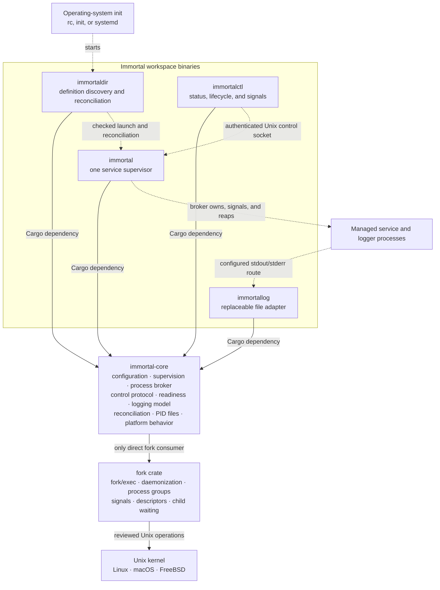

# immortal

Immortal is being rebuilt in Rust as a focused Unix process supervisor for
Linux, macOS, and FreeBSD. It is not an init system and will not run as PID 1.
The operating system's init system starts `immortaldir`; Immortal then owns the
lifecycle of configured application processes.

```text
OS init (PID 1)
    `-- immortaldir
          |-- immortal: api ---- supervised process group
          |                       `-- supervised logger pipeline
          |-- immortal: worker
          `-- immortal: database

immortalctl -------- authenticated local control --------> immortal
```

The Go implementation remains available on `master` and `develop` as a
requirements and historical reference. Those branches are read-only during the
Rust rewrite. The Rust generation deliberately does not promise drop-in
configuration or protocol compatibility.

## Design direction

The rewrite keeps the useful product shape of the Go release while correcting
the process-management problems identified in the original
[Hacker News review](https://news.ycombinator.com/item?id=14003971), the
[Lobsters discussion](https://lobste.rs/s/svv0kz/nix_cross_platform_os_agnostic),
and the design documentation for
[daemontools](https://cr.yp.to/daemontools/supervise.html),
[runit](https://smarden.org/runit/benefits), and
[s6](https://skarnet.org/software/s6/overview.html).

- Owned services remain direct children until they are reaped. PID files are
  output-only metadata, never process identity.
- Each service generation owns a process group. Lifecycle cleanup targets the
  group; compatibility signal commands target the main process unless stated
  otherwise.
- Self-daemonizing applications use an explicit descriptor-based compatibility
  mode with application control hooks. PID adoption is not considered safe.
- Tokio is used for timers, signals, pipes, and Unix sockets, but process
  supervisors use a current-thread runtime so `fork` never runs from a
  multithreaded runtime.
- Logger commands are separately supervised processes. Immortal preserves the
  pipes so a service and its logger can restart independently.
- The privileged HTTP server is replaced by a bounded, versioned local control
  protocol. A future web gateway must be a separate unprivileged component.
- Filesystem notifications only trigger reconciliation. A complete desired
  versus current-state scan remains authoritative.
- Restarting forever with capped backoff is the default. Explicit attempt,
  burst/window, or elapsed-time limits can place a crash loop in `Failed`.
- Readiness and portable start conditions handle dependencies without copying
  systemd targets into Immortal.

### Canonical fork-library gate

Immortal currently pins the reviewed candidate from
[`immortal/fork#16`](https://github.com/immortal/fork/issues/16) by commit so
local, DevPod, and CI builds use the same process contract. That candidate adds
checked process and process-group identifiers, full nonblocking child events,
explicit signal targets, prepared direct execution, descriptor allow-lists,
and checked daemon startup.

`immortal-core::process` is incrementally adopting those APIs. It now translates
the fork crate's typed `Exited`, `Signalled`, `Stopped`, and `Continued` events
without decoding raw wait statuses or exposing fork-library types to the rest
of Immortal. Its blocking broker mechanism also materializes direct commands,
creates a dedicated process group, reports exec failure before start, and uses
typed process or group signal targets. Its owned descriptor allow-list preserves
only deliberate mappings across `exec`; readiness uses the same general path.
A single-threaded native contract proves exit, exec failure, descriptor
inheritance and omission, stop/continue, group termination, bounded waits, and
cleanup.
The private broker IPC is now bounded and versioned. The supervisor addresses
only monotonic generations across it; raw PIDs remain broker-owned observations.
A pre-Tokio broker contract proves readiness, spawn and failure responses,
signal acknowledgement, complete child-event draining, residual descendant
cleanup, bounded shutdown, and broker reaping. Foreground and checked daemon
launches share the same executor. Daemon mode materializes configuration and
account data first, detaches before Tokio, and reports success only after the
broker and optional authenticated control socket are ready. The executor also
applies pre-resolved numeric credentials and publishes replacement-safe atomic
supervisor/main PID files as observation only. Broker reads use one persistent
task and bounded queue so cancellation cannot split a frame. Logger routes,
pre-start conditions, and post-exit hooks use the same broker boundary;
descriptor-tracking uses an independently monitored lifetime capability and
never promotes a PID-file value into process identity.

Foreground supervisors can now opt into an exact absolute service runtime
directory with `--control-dir ROOT/SERVICE`. Immortal acquires and retains a
mode-`0600` advisory lock before broker creation, removes only a proven owned
stale socket after locking, creates a mode-`0600` authenticated control socket,
and serializes broker events, timers, Unix shutdown signals, and control work
through one lifecycle owner. Status, start, stop, once, restart, halt, raw
signals, and deliberate live-child exit are operational. `exit` uses an
explicit generation-bound broker detach; it never turns a PID file into process
identity. A black-box contract covers exclusion of a duplicate supervisor,
stale-generation and wrong-service rejection, status publication, USR1, the
persistent Down state, manual starts, restart, halt, socket cleanup, and
live-child detachment.

Immortal will not add direct `libc` calls or a second process library to work
around this boundary. `fork` owns the safety-sensitive Unix mechanisms;
Immortal owns the broker protocol, lifecycle generations, supervision policy,
readiness, logging, control, status, and reconciliation. After integration and
native review, the candidate can be released and the commit pin replaced with
the released crate version.

Dependency planning is deterministic and portable. Enabled services are
topologically sorted into start waves, and the next wave waits for its
requirements to become Ready. Within a wave, `immortaldir` submits bounded
checked-launch batches through its one pre-Tokio broker; the default limit is
8, `--max-concurrent-starts` can select 1 through 64, and
`IMMORTAL_MAX_CONCURRENT_STARTS` provides the equivalent environment input.
Missing or disabled requirements and cycles reject the plan. A requirement
gates start only—later dependency failure does not cascade a stop.
Per-service `start_condition` execution remains inside the launched
supervisor's process broker. `immortaldir` observes `WaitingCondition` and waits
for Ready; failed conditions consume neither a service start nor its retry
limits.

See [DESIGN.md](DESIGN.md) for module ownership and implementation rules.

## Workspace

- `immortal-core`: reusable configuration, process, supervision, logging,
  control-protocol, reconciliation, and platform behavior.
- `immortal`: daemonize and supervise one service.
- `immortalctl`: inspect supervisors, change desired state, and deliver signals.
- `immortaldir`: reconcile a directory of service definitions.
- `immortallog`: minimal, replaceable stdin-to-file compatibility adapter with
  bounded-memory streaming, rotation, retention, timestamps, and optional raw
  byte pass-through. External logger commands remain the preferred interface.



Solid arrows are Rust/Cargo dependencies. Dashed arrows are runtime
relationships. CLI crates never call `fork` directly: all process behavior
crosses the `immortal-core::process` boundary.

Each CLI follows the one-way flow:

```text
commands -> dispatch -> actions -> start -> main
```

Every executable's `--version` output includes the shared package version and
the full source commit, for example `immortal 0.1.0 - 446209f...`. Builds made
without Git metadata report `unknown` instead of failing. The short `-V` form
prints only the executable name and package version, such as `immortal 0.1.0`.

## Compatibility and upgrade policy

The Rust rewrite is a new major generation, not a drop-in replacement for the
Go release. It accepts one configuration schema only: the strict document with
`version: 2`. Unversioned Go YAML and every other version fail validation; there
is no runtime migration or compatibility parser. Operators must deliberately
rewrite and validate definitions before upgrading.

Selected Go CLI spellings remain aliases where they are unambiguous and safe.
This convenience does not imply configuration, control-protocol, process, or
behavioral compatibility. Intentional changes are documented and tested.

| Contract | Rust policy |
|---|---|
| Go CLI flags and signal aliases | Preserve as aliases and contract fixtures |
| Unversioned Go `.yml` definitions | Reject; rewrite explicitly as `version: 2` |
| Runtime paths and service names | Use platform-native system roots plus `$HOME/.immortal`; validate ownership |
| PID output files | Preserve as output-only metadata |
| Go `pid.follow` configuration | Reject; use explicit descriptor tracking and lifecycle hooks |
| HTTP-over-Unix-socket control | Replace with a bounded versioned protocol |
| Go status JSON | Preserve equivalent information in `immortalctl --output json` |
| Exact internal Go architecture | Do not preserve |

`immortalctl` output consumers must account for the explicit discovery scope:
the table begins with `SCOPE`, and JSON records include a `scope` field. This
removes unsafe implicit precedence when system and user services share a name.

Two historical requests are explicit contracts:

- [Issue #71](https://github.com/immortal/immortal/issues/71): support
  retry-until-success with `restart = on-failure`, configurable successful exit
  codes, and optional supervisor exit when no restart is required.
- [Issue #68](https://github.com/immortal/immortal/issues/68): support portable
  readiness and start conditions. OS-specific boot ordering remains the init
  system's responsibility.

### Configuration schema

The only accepted schema is `version: 2`. The version marker is mandatory,
unknown fields fail validation, commands are argv arrays, durations state their
unit, and every nested policy is typed. The complete currently implemented
shape is:

```yaml
version: 2
enabled: true
command: [/usr/local/bin/api, --foreground]
working_directory: /srv/api
environment:
  RUST_LOG: info
environment_mode: inherit # inherit | clear
user: www
start_delay_seconds: 0

restart:
  policy: on-failure       # always | on-failure | never
  success_exit_codes: [0]
  exit_when_done: false
  limits:
    max_retries: null      # restarts after the initial start
    max_elapsed_seconds: null
    burst:                 # null disables the rolling limit
      starts: 5
      window_seconds: 60
  backoff:
    initial_seconds: 1
    max_seconds: 60
    multiplier: 2
    jitter_percent: 20
    reset_after_seconds: 60

readiness:
  mode: immediate         # immediate | notify-fd
  timeout_seconds: 30
requires: [database]
start_condition:
  command: [/usr/bin/test, -e, /var/run/network-ready]
  timeout_seconds: 10
  backoff:
    initial_seconds: 1
    max_seconds: 30
    multiplier: 2
    jitter_percent: 20
post_exit:
  command: [/usr/local/libexec/api-cleanup]
  timeout_seconds: 30

logging:
  file_adapter: null      # null uses immortallog beside immortal
  combine_stderr: false
  restart:
    max_retries: null     # restarts after the initial logger start
    backoff:
      initial_seconds: 1
      max_seconds: 60
      multiplier: 2
      jitter_percent: 20
      reset_after_seconds: 60
  stdout:
    file:
      file: /var/log/api.log
      max_age_seconds: 86400
      keep: 7
      max_bytes: 10485760
      max_total_bytes: 73400320
      timestamp: true
    logger: [/usr/bin/logger, -t, api]
  stderr:
    file: {}
    logger: null

pid_files:
  supervisor: /var/run/api.supervisor.pid
  main: /var/run/api.pid
process_mode: foreground  # foreground | descriptor-tracking
```

Self-daemonizing software which cannot run in the foreground must instead use
the explicit descriptor contract:

```yaml
version: 2
command: [/usr/local/sbin/legacy-daemon]
process_mode: descriptor-tracking
descriptor_tracking:
  stop:
    command: [/usr/local/sbin/legacy-daemonctl, stop]
    timeout_seconds: 30
  reload:
    command: [/usr/local/sbin/legacy-daemonctl, reload]
    timeout_seconds: 30
  lifetime_timeout_seconds: 30
```

All shown sections except `version` and `command` have defaults. Absent restart
limits mean retry forever. A burst value requires both nonzero fields.
`success_exit_codes` cannot be empty. Lifecycle, readiness, and condition
deadlines are capped at 24 hours; scheduled delay/backoff values are capped at
one year so monotonic deadline construction remains representable. `notify-fd` publishes
`IMMORTAL_READY_FD=3`. The child must write the exact six-byte `READY\n` token
before its configured deadline; fragmented writes are accepted, while invalid
tokens, early EOF, and timeout fail that generation. The broker creates the
CLOEXEC descriptor channel before spawning, maps only the child endpoint, and
monitors the supervisor endpoint asynchronously without creating worker threads.
`start_condition` runs before a generation is allocated and has its own retry
history, so a failing dependency check cannot consume service restart limits.
`post_exit` runs after the service generation has ended and before the
selected restart, Down, Failed, or Exited transition is published. Its resolved
service environment also contains `IMMORTAL_EXIT_KIND` (`exit`, `signal`,
`lifetime`, or `lifetime-failed`),
`IMMORTAL_EXIT_STATUS`, `IMMORTAL_GENERATION`, `IMMORTAL_START_FAILED`, and
`IMMORTAL_READINESS_FAILED`. Hook exec failure or a nonzero hook result does not
replace the service result; timeout or supervisor shutdown kills and reaps the
hook process group.
Descriptor tracking requires both bounded lifecycle hooks. The broker maps only
the service endpoint to descriptor 4 and publishes `IMMORTAL_LIFETIME_FD=4`.
The application must keep that descriptor open across its own fork and close it
only when the self-daemonized generation has ended; writing data is a protocol
failure. The direct launcher PID is cleared as soon as it is reaped, while the
generation remains Ready until EOF. `stop`, `restart`, and `halt` execute the
stop hook and then wait `lifetime_timeout_seconds` for EOF. HUP executes the
reload hook. Other raw signals and supervisor detachment are rejected because
there is no adopted PID to target. Hook failure or timeout restores the live
generation instead of pretending it stopped. If the supervisor connection is
lost, the pre-runtime broker owns one materialized fallback copy of the stop
contract, executes it, and waits for lifetime closure before exiting.

Foreground mode remains preferred because it preserves direct parentage and
process-group control. Common upstream-supported forms include:

- nginx: `nginx -g 'daemon off;'`; keep `master_process` enabled. See the
  [nginx daemon directive](https://nginx.org/en/docs/ngx_core_module.html#daemon)
  and [command-line switches](https://nginx.org/en/docs/switches.html).
- OpenSSH: `sshd -D -e` keeps the server attached and sends diagnostics to
  stderr. See the [OpenBSD sshd manual](https://man.openbsd.org/sshd.8).
- Redis: configure `daemonize no`, as recommended for external supervisors in
  the [Redis administration guide](https://redis.io/docs/latest/operate/oss_and_stack/management/admin/).

Descriptor tracking is a compatibility boundary for software without a usable
foreground mode, not the default supervision model.

`start_condition` executes through the same single-threaded process broker with
the service's resolved environment, working directory, and credentials. Exit
status zero permits one service generation; nonzero exit, signal termination,
or spawn failure retries with the condition's independent backoff. A timeout
kills and reaps the condition process group before retrying. Condition attempts
never consume service restart limits or increment the service start count.

When reading a file, Immortal resolves working directories, PID/log paths,
hook/logger executables containing `/`, and service executables containing `/`
before daemonization. File/PID/hook/logger paths are relative to the definition
directory; the service executable is relative to its resolved working
directory. Bare executable names remain unresolved for the process executor's
`PATH` lookup. `environment_mode: inherit` defines overrides after the
supervisor environment; `clear` defines an empty base with only configured
values.

Logging routes are process chains, not in-supervisor multiwriters. For example,
a file plus an external logger is normalized to `service -> immortallog ->
external logger`. `combine_stderr: true` attaches both child streams to the
stdout chain and conflicts with an explicit stderr route. `immortallog
--passthrough` writes the original bytes downstream even when its file copy is
timestamped, and it imposes no maximum line length. Rotation syncs the live
file, atomically renames it into an Immortal-owned archive namespace, creates a
replacement, and enforces archive-count and aggregate-byte limits both on open
and after rotation.
The broker creates and retains every CLOEXEC pipe endpoint before starting a
logger. Service and logger restarts receive duplicated endpoints, so pipe
identity and lossless kernel backpressure remain stable. Logger exec success
gates the first service start; logger crashes use independent capped
exponential backoff. `logging.restart.max_retries` bounds restarts after each
logger's initial start; `null` retries forever, and a stable runtime resets that
logger's failure streak. Exhaustion before a service generation exists cancels
only childless pre-start work and publishes service and logger `Failed` health.
Exhaustion while a service is live leaves that service running and publishes
logger `Failed` health. An accepted `start`, `once`, or `restart` resets failed
logger stages and their retry histories. Final shutdown closes broker writer
masters, drains to EOF, then terminates logger groups downstream-first after a
hard deadline. A logged service currently rejects control `Exit`, because
abandoning only the service would break ownership of its broker-backed logging
graph; use `Halt` until whole-graph detach is implemented.
`logging.file_adapter` may select another external adapter path; otherwise
Immortal uses `immortallog` beside its own executable.

The resilience contracts execute a non-executable logger target, stream 16 MiB
through a deliberately paused logger, and run a logger which consumes EOF but
survives TERM. They prove that permission denial prevents the service start,
kernel-pipe backpressure remains lossless, and drain expiry escalates through
TERM to KILL before the broker is reaped. Logger stages which have already
failed or entered backoff own no drainable child and normalize to Down so
shutdown does not spend grace periods waiting for nonexistent work.

Exactly one service source is accepted. With `--config`, direct command options
are rejected instead of being silently merged; change the definition directly.
`--check-config` validates and emits the same canonical schema without modifying
the input. Without `--config`, CLI defaults are resolved first and
explicit CLI values override only those defaults. Arguments after the child
command begins are always child argv, even when they look like Immortal flags.

### Runtime and control boundary

The system runtime root is `/run/immortal` on Linux and `/var/run/immortal` on
macOS and FreeBSD; the latter follows their native hierarchy while Linux uses
the FHS runtime location for transient Unix sockets. The portable user root is
`$HOME/.immortal`. `immortaldir` defaults to the platform system root.
`immortalctl` automatically discovers both roots, while `--runtime-scope
system|user` narrows automatic discovery and an explicit `--runtime-dir` or
`IMMORTAL_SDIR` selects exactly one custom root.
[FHS `/run`](https://specifications.freedesktop.org/fhs/latest/run.html)

Each service is discovered only at `ROOT/SERVICE/immortal.sock`. The root must
be absolute, canonical, a real directory, and not group/world writable. The
automatic user root must also belong to the effective UID. Service directories
must grant no group/other bits (normally `0700`); sockets must be mode `0600`;
root, service directory, and socket ownership must agree. Hidden, unsafe,
symlinked, wrongly owned, or wrongly typed entries are reported and ignored
without mutation.

Automatic discovery has one global 4096-service bound. A missing automatic root
is treated as empty; an unsafe automatic root is isolated, reported, and makes
the overall result partial without hiding valid services from the other root.
Status output includes `system`, `user`, or `custom` scope. Identical names from
both automatic roots remain visible for all-status output, but a named mutation
is rejected as ambiguous until `--runtime-scope` selects one root.

The server authorizes only root or the socket owner using native Unix peer
credentials on Linux, macOS, and FreeBSD. It never removes an entry merely
because it looks stale, and listener cleanup removes only the exact socket
device/inode it created. Frames are limited to 64 KiB, reads/writes/connects and
accepts have five-second idle deadlines, and active clients are bounded. Every
mutation is preceded by a status probe and carries `NoChild` or an exact
generation; unguarded mutations and generation races are rejected.

Status responses use a typed bounded binary payload rather than an
interpolated string or privileged JSON parser. The payload carries supervisor
and main PID, desired and observed state, readiness, uptime/down time, start and
failure counters, last result, backoff, logger health, and exact argv. Command
argument count, individual argument length, and total frame size are bounded.
`immortalctl` alone converts this payload to stable JSON or a
control-character-safe table. The foreground controlled executor populates the
payload from live broker and lifecycle observations, including supervisor/main
PID, argv, starts, failures, timing, backoff, and the last terminal result.
After the authenticated socket is bound, status reports `Initializing` while
required logger stages are starting or backing off; no service generation or
main PID exists in that state. Successful logger initialization transitions
exactly once into normal start processing. Bounded logger exhaustion instead
publishes `Failed`, and an explicit start operation can retry initialization.
The authenticated socket loop isolates each client, forwards requests through
a bounded channel, and waits for the single-owner supervisor event loop to
publish the completion response. Socket tasks never mutate lifecycle state.
Shutdown aborts and joins every remaining connection task.

Lifecycle mutations wait up to `--timeout 30` seconds by default. Start waits
for Ready, stop for Down, restart for a different Ready generation, and once
for a generation to appear and then return Down. Halt/exit complete when their
owned control socket disappears. `--no-wait` explicitly returns after request
acceptance. The outer deadline bounds polling and each generation comparison
remains race-safe.

Filesystem notifications use the native recommended backend (inotify,
FSEvents, or kqueue) only as hints. Hints are nonrecursive and debounced for
250 ms before a complete scan. Saturated/coalesced event delivery is safe
because a complete scan runs at startup and every 30 seconds regardless of
notifications.

`immortaldir` can reconcile once or continuously. It creates one dedicated
launcher broker before Tokio, publishes normalized launch snapshots in an
owner-only `.definitions` directory below the runtime root, and starts each
missing supervisor through checked `immortal --config ... --control-dir ...`
daemon startup. Mutations use the authenticated control protocol with exact
generation matching; replacement waits for both socket removal and release of
the supervisor advisory lock. A held lock without a usable control socket is
reported and retried rather than treated as absence; an unlocked stale runtime
is reclaimed only by the normal checked supervisor acquisition path. Applied
snapshots preserve semantic comparison and enabled/Down intent when
`immortaldir` restarts. `--dry-run` performs the same bounded scan and planning
without opening a broker or touching runtime state.

The continuous reconciler retains last-known-good definitions, treats invalid
replacements as present, and requires two complete scans to confirm deletion.
Incomplete enumeration never advances deletion confirmation. It preserves an
unchanged healthy supervisor, stops an enabled supervisor when the definition
becomes disabled, relaunches on re-enable, preserves an operator-requested Down
state across configuration changes, and halts a supervisor only after stable
deletion. A failed service retains one typed pending mutation for a later scan
without blocking independent services in the current scan. Operational
stops and replacement preparation remain serialized for generation safety;
independent checked starts run in bounded batches. Cross-restart deletion
confirmations remain tracked work.

### Boot and network ordering

The host init system starts and stops `immortaldir`; Immortal does not replace
PID 1 or duplicate machine boot policy. Use coarse OS ordering only to ensure
the definitions/runtime filesystems and basic networking machinery exist, then
use each service's broker-executed `start_condition` for the exact resource it
needs. Interfaces, routes, DNS, remote peers, and credentials can change after
boot, so “the network target ran” is not application readiness.

- On Linux with systemd, install a normal `Type=simple` unit for
  `immortaldir`. Add both `Wants=network-online.target` and
  `After=network-online.target` only when the directory manager itself needs a
  configured network; `network.target` alone does not mean connectivity is
  usable. See the official
  [systemd network-ordering guidance](https://www.freedesktop.org/software/systemd/man/257/rc-local.service.html).
- On FreeBSD, install an `rc.d` wrapper with `# PROVIDE: immortaldir`, a
  site-appropriate `# REQUIRE:` line such as `NETWORKING SERVERS`, and
  `# KEYWORD: shutdown`, then enable it through `rc.conf`. `rcorder` establishes
  ordering, not proof that a required daemon successfully started; the service
  condition remains authoritative. See FreeBSD's
  [rc.d scripting guide](https://docs.freebsd.org/en/articles/rc-scripting/).
- On macOS, install a system LaunchDaemon whose `ProgramArguments` execute
  `immortaldir`, with `RunAtLoad` and `KeepAlive` for the long-running watcher.
  Do not model a dynamic interface as a permanent dependency; Apple explicitly
  notes that network availability can come and go. See
  [Creating launchd jobs](https://developer.apple.com/library/archive/documentation/MacOSX/Conceptual/BPSystemStartup/Chapters/CreatingLaunchdJobs.html).

### Exit status contract

Clap retains `0` for help/version and `2` for syntax errors. After typed
dispatch, every executable uses a shared BSD `sysexits(3)`-style contract:

| Code | Meaning |
|---:|---|
| 0 | success |
| 64 | typed usage/dispatch error |
| 65 | malformed data or protocol |
| 66 | missing file or service |
| 69 | unavailable capability or supervisor |
| 70 | internal invariant/software failure |
| 71 | operating-system facility failure |
| 73 | runtime/output creation failure |
| 74 | I/O failure |
| 75 | retryable generation conflict or timeout |
| 77 | permission/peer authorization failure |
| 78 | invalid service/runtime configuration |
| 79 | partial multi-service failure |

## Implementation status

An item is checked only after implementation, documentation, success and
failure tests, and required CI pass.

### General foundation

- [x] Rust workspace and one-way CLI layering.
- [x] Initial CLI parsers and parser unit tests.
- [x] Include the source Git commit in every executable's long version output.
- [x] DevPod CI and FreeBSD cross-check baseline.
- [x] Document focused-supervisor scope and reject PID 1 ambitions.
- [x] Record research findings and compatibility decisions.
- [x] Capture relevant released Go behavior as requirements research.
- [x] Add fork-backed process/path lifecycle contract fixtures.
- [x] Add resource-bounded strict `version: 2` configuration parsing.
- [x] Reject unversioned Go definitions and every unsupported version.
- [x] Add normalized configuration resolution and canonical output.
- [x] Define stable application errors and CLI exit codes.
- [x] Add safe runtime-directory ownership and permission policy.
- [x] Add process-generation identifiers independent of PIDs.
- [x] Wrap terminated-child waits as typed exited/signalled results.
- [x] Add typed stopped/continued collection to `fork` and consume it through `immortal-core`.
- [x] Add native Linux, macOS, and FreeBSD lifecycle jobs.
- [x] Add deterministic arbitrary/truncation/byte-mutation decoder corpora.
- [x] Add continuous coverage-guided configuration and protocol fuzzing.
- [x] Add release baselines for configuration and control codecs.
- [ ] Add cross-platform lifecycle benchmarks and reviewed regression budgets.

### immortal

#### CLI and configuration

- [x] Accept every released Go short flag and modern long alias.
- [x] Preserve option-looking child arguments after the command begins.
- [x] Define configuration versus CLI precedence explicitly.
- [x] Implement `--check-config` / `-cc` success and failure behavior.
- [x] Emit the canonical supported schema without modifying the input file.
- [x] Validate command, cwd, environment, PID outputs, logger, hooks, readiness,
  restart policy, and start conditions.
- [x] Resolve configured users against the target OS account database.
- [x] Resolve absolute paths before daemonization changes cwd.
- [x] Make environment inheritance, clearing, and override order deterministic.
- [x] Reject empty commands, invalid durations, duplicate keys, conflicting
  options, oversized files, and excessive YAML nesting/aliases.
- [x] Reject unknown users and enforce UID/GID transition policy.

#### Process lifecycle

- [x] Run and reap foreground direct children through the supervisor state machine.
- [x] Fork only through `immortal-core::process` and the `fork` crate.
- [x] Start a dedicated single-threaded process broker before Tokio.
- [x] Bound and version broker IPC without accepting raw PID targets.
- [x] Daemonize before creating Tokio or any other thread.
- [x] Implement double-fork/session detachment and safe stdio redirection.
- [x] Preserve inherited descriptors through an explicit allow-list.
- [x] Report daemon startup success or failure to the invoking process.
- [x] Hold the service lock descriptor for the supervisor lifetime.
- [x] Remove stale sockets only after acquiring the service lock.
- [x] Create every service generation in its own process group.
- [x] Distinguish exec failure from a successfully executed process.
- [x] Drain all child wait events after each coalesced `SIGCHLD`.
- [x] Recover missed child notifications with an ownership-checked delayed reap sweep.
- [x] Clean remaining process-group members before generation reuse.
- [x] Write and invalidate configured parent/child PID files atomically.
- [x] Never use signal 0 or PID files to identify an owned service.

#### State and restart policy

- [x] Model and encode `Initializing`, `WaitingCondition`, `Starting`, `Running`,
  `Ready`, `Paused`, `Stopping`, `Backoff`, `Completed`, `Failed`, and `Exited`.
- [x] Publish `Initializing` while runtime resources are being acquired.
- [x] Keep desired state separate from observed state.
- [x] Implement Up, Down, Once, Restart, Halt, and Exit transitions.
- [x] Implement `always`, `on-failure`, and `never` restart policies.
- [x] Implement configurable successful exit codes and `exit_when_done`.
- [x] Implement exponential backoff with a stable-runtime reset.
- [x] Implement attempt, burst/window, and elapsed retry limits.
- [x] Keep condition failure/backoff separate from service attempts.
- [x] Ensure manual start/restart resets Backoff and Failed.
- [x] Return valid status in every state, including before the first child.
- [x] Gracefully halt on supervisor `SIGTERM` and `SIGINT`.

#### Readiness, hooks, and self-daemonizing applications

- [x] Support immediate readiness after successful exec.
- [x] Define and test the bounded `IMMORTAL_READY_FD` token and timeout reader.
- [x] Create, inherit, and monitor the readiness descriptor through `fork`.
- [x] Define and validate argv conditions with independent timeout/backoff.
- [x] Execute pre-start conditions through the process broker.
- [x] Run bounded post-exit hooks with exit/signal and generation context.
- [x] Implement descriptor-based fghack lifetime tracking.
- [x] Require stop/reload hooks for fghack and reject raw adopted-PID signals.
- [x] Document foreground invocations for common self-daemonizing software.

### immortalctl

#### Discovery, status, and output

- [x] Discover system and user supervisors from documented runtime roots.
- [x] Validate ownership and ignore malformed/unknown entries.
- [x] Avoid broad stale-directory deletion.
- [x] Show all services when no command is supplied.
- [x] Support one service, `--all`, and legacy `*`.
- [x] Provide stable table and JSON output without terminal escapes in JSON.
- [x] Define, bound, transport, and render discovery scope, supervisor/main PID,
  generation, desired/state, readiness, uptime/down time, starts, failures,
  last result, backoff, logger health, and command.
- [x] Populate typed status fields from the supported fork-backed foreground runtime.
- [x] Represent childless states without assuming a PID exists.
- [x] Define nonzero exits for missing targets, partial failure, authorization,
  timeout, and protocol mismatch.

#### Lifecycle commands

- [x] `status`: inspect without mutation.
- [x] `start` / `up`: set Up and reset configured failure.
- [x] `stop` / `down`: TERM+CONT the group, escalate, remain supervised Down.
- [x] `once`: start one generation and remain Down after it exits.
- [x] `restart`: stop/reap then start a new generation in the same supervisor.
- [x] `exit`: explicitly leave the service running and warn about orphaning.
- [x] `halt`: stop the group, reap it, and exit the supervisor (logger draining remains pending).
- [x] Wait deterministically for typed lifecycle completion with a hard timeout.
- [x] Provide `--no-wait` for explicitly asynchronous control.

#### Signal delivery

- [x] `-1` / `signal usr1` -> main process.
- [x] `-2` / `signal usr2` -> main process.
- [x] `-a` / `signal alrm` -> main process.
- [x] `-c` / `signal cont` -> main process.
- [x] `-h` / `signal hup` -> main process.
- [x] `-i` / `signal int` -> main process.
- [x] `-k` / `signal kill` -> service process group.
- [x] `-in` / `signal ttin` -> main process.
- [x] `-ou` / `signal ttou` -> main process.
- [x] `-q` / `signal quit` -> main process.
- [x] `-s` / `signal stop` -> main process.
- [x] `-t` / `signal term` -> main process.
- [x] `-w` / `signal winch` -> main process.
- [x] Reject multiple conflicting legacy signal flags.
- [x] Reject absent, exited, stale-generation, and descriptor-unowned targets.
- [x] Support explicit `--scope main|group`.
- [x] Confirm STOP/TTIN/TTOU/CONT through child wait events.
- [x] Preserve the signal exit reason for restart-policy decisions.

#### Control protocol

- [x] Replace HTTP with a fixed versioned request and bounded response codec.
- [x] Authenticate root or the supervisor UID using Unix peer credentials.
- [x] Restrict runtime-directory and socket modes.
- [x] Bound frames, clients, reads, writes, and idle time.
- [x] Forward authenticated requests to one lifecycle owner over a bounded channel.
- [x] Run the authenticated control-server loop inside controlled foreground `immortal`.
- [x] Reject malformed, truncated, oversized, unknown-version, and unknown-op
  requests.
- [x] Bind mutations to an expected service generation.
- [x] Keep JSON on the client/output side, not privileged server input.

### immortaldir

#### Reconciliation

- [x] Validate and canonicalize the definitions directory.
- [x] Scan only top-level non-hidden regular `*.yml` files.
- [x] Ignore editor swap/temp files and unrelated extensions.
- [x] Reject unsafe names, duplicate names, symlinks, path traversal, oversized
  files, and excessive definition counts.
- [x] Read each definition as a stable snapshot before parsing.
- [x] Retain the last-known-good service after an invalid/partial replacement.
- [x] Compare semantic configuration rather than mtimes.
- [x] Use native inotify, FSEvents, and kqueue notifications.
- [x] Treat notifications only as full-reconciliation triggers.
- [x] Debounce editor write/rename sequences.
- [x] Perform a 30-second safety reconciliation.
- [x] Recover from dropped and coalesced filesystem notifications.
- [x] Implement mutation-free `--once --dry-run` output.
- [x] Never remove unknown runtime files or directories.
- [x] Detect stale supervisors via lock/control state rather than PID guessing.

#### Desired state and dependencies

- [x] Start enabled definitions missing from runtime state.
- [x] Preserve healthy unchanged supervisors.
- [x] Plan restart only after a valid semantic configuration change.
- [x] Apply a planned restart through the supervisor control boundary.
- [x] Confirm stable deletion across two complete authoritative scans.
- [x] Stop and exit a service after confirmed deletion.
- [x] Retain persistent `enabled: false` in desired state.
- [x] Apply disabled desired state to a live supervisor.
- [x] Preserve an operator-requested Down state while its supervisor lives.
- [x] Restart an exited supervisor whose definition remains enabled.
- [x] Prevent duplicate semantic plan actions from watcher and periodic scans.
- [x] Retain and retry one pending mutation per service after partial failure.
- [x] Isolate per-service mutation failures within a complete scan.
- [x] Bound concurrent starts/restarts.
- [x] Validate `requires`, missing dependencies, and cycles.
- [x] Start independent services concurrently.
- [x] Gate dependent starts on Ready without later cascading stops.
- [x] Keep waiting dependents from consuming retry limits.
- [x] Plan portable start conditions with independent timeout/backoff.
- [x] Gate operational starts on broker-executed condition success.
- [x] Document Linux, FreeBSD, and macOS boot/network ordering.
- [x] Add issue #68 readiness and condition regression fixtures.

### Logging

- [x] Supervise external logger commands as independent children.
- [x] Use argv rather than implicit shell strings.
- [x] Confirm logger exec success before starting its service.
- [x] Preserve stable pipe endpoints across service/logger restarts.
- [x] Restart service and logger independently without losing the pipe.
- [x] Expose logger Starting, Ready, and Backoff health in status.
- [x] Add configurable logger retry exhaustion and expose Failed health.
- [x] Default to lossless backpressure instead of silent dropping.
- [x] Stop the service before draining and stopping its logging chain.
- [x] Provide a small, replaceable `immortallog` file compatibility adapter.
- [x] Support combined output, separate stderr, and file-plus-command chains.
- [x] Keep byte fan-out out of the supervisor.
- [x] Sync before rotation and use atomic timestamped archives.
- [x] Recover interrupted rotation and enforce count/total-size retention.
- [x] Inject disk-write/sync failure and broken downstream pipes.
- [x] Stream huge and partial lines without unbounded line buffering.
- [x] Test a real logger crash loop through exhaustion and manual recovery.
- [x] Test real permission failures, pipe backpressure, and shutdown drain
  timeouts.

## Coverage-guided fuzzing

The `fuzz` directory is a separate Cargo workspace so nightly-only libFuzzer
tooling never enters the release dependency graph. Its `config` target exercises
the strict configuration byte parser, while `control` exercises both public
request and response frame decoders. A valid version 2 definition seeds the
configuration target; generated corpus entries and crash artifacts remain local
and outside Git.

Install `cargo-fuzz` and run bounded local checks inside DevPod:

```sh
scripts/dev-ssh cargo install cargo-fuzz --locked
scripts/dev-ssh rustup toolchain install nightly --profile minimal
scripts/dev-ssh cargo +nightly fuzz run config -- -max_total_time=60 -timeout=10 -rss_limit_mb=2048
scripts/dev-ssh cargo +nightly fuzz run control -- -max_total_time=60 -timeout=10 -rss_limit_mb=2048
```

The dedicated GitHub Actions workflow runs both targets for one minute after
relevant pushes and pull requests, and for ten minutes on its weekly schedule.
Every run has per-input, memory, job, and overall campaign bounds so malformed
input cannot consume CI indefinitely.

## Performance baselines

Run the dependency-free release harnesses inside DevPod:

```sh
scripts/dev-ssh cargo bench -p immortal-core --bench core_contracts
scripts/dev-ssh cargo bench -p immortal-core --bench lifecycle_contracts
```

The initial Linux x86_64 DevPod medians recorded on 2026-07-11 are
informational reference points:

| Contract | Median |
|---|---:|
| Representative configuration parse | 82,602 ns/op |
| Control request encode + decode | 39 ns/op |
| Typed status encode + decode | 130 ns/op |

The first local fork-backed run on the same DevPod class, recorded on
2026-07-12, produced these additional reference points:

| Contract | Median |
|---|---:|
| Broker spawn + normal exit + reap | 504,126 ns/op |
| Broker spawn + `SIGTERM` + reap | 333,174 ns/op |

These are not portable CI thresholds. Regression budgets will be set only after
the fork-backed spawn/wait/signal path is measurable on Linux, macOS, and
FreeBSD and normal host variance is known. The native lifecycle jobs now record
median fork-spawn-wait and fork-spawn-signal-wait latency on all three operating
systems. The lifecycle harness includes command materialization, broker IPC,
process creation, acknowledgement, and terminal reaping; it uses hard event and
cleanup deadlines and retains the active process-group identity until reaping.
Each native job uploads a 90-day `lifecycle-benchmark-*` artifact containing the
two medians plus commit, workflow-run, runner, kernel, and pinned-toolchain
metadata. Rerunning the same workflow attempt creates a distinct artifact, so
reviewers can retain every valid sample without copying values from console
logs.
The checklist remains pending until multiple remote runs establish reviewed
per-platform budgets rather than thresholds inferred from one Linux machine.

Budget acceptance follows a recorded process:

1. Collect at least ten successful runs for each metric and platform across at
   least three days, using the same pinned toolchain, runner image, and commit.
2. Retain every valid result. Exclude a run only when a documented runner or
   platform incident invalidated the complete job, never because its latency is
   inconvenient.
3. Record the median, maximum, and nearest-rank p95 of the per-run medians. Set
   the initial ceiling no lower than 125% of the observed maximum so ordinary
   shared-runner variance does not become a correctness gate.
4. Store separate Linux, macOS, and FreeBSD ceilings; the QEMU-backed FreeBSD
   result must never inherit a Linux or macOS threshold.
5. Investigate one ceiling breach and confirm it with a clean rerun before
   treating it as a regression. Loosen a ceiling only with linked measurements
   explaining the environmental or architectural change.

The accepted evidence and ceilings will replace this pending table:

| Platform | Runner | Runs | Spawn/reap ceiling | Signal/reap ceiling |
|---|---|---:|---:|---:|
| Linux | Ubuntu 24.04 | pending | pending | pending |
| macOS | macOS 15 | pending | pending | pending |
| FreeBSD | FreeBSD 14.3 QEMU guest | pending | pending | pending |

## Build and validation

The repository pins Rust 1.97.0, matching `rust-version`. GitHub Actions runs
the complete workspace test suite on Ubuntu 24.04 and macOS 15. The existing
FreeBSD cross-check remains a fast compile gate, while a separate
[FreeBSD VM action](https://github.com/vmactions/freebsd-vm) pinned to v1.4.6
runs the same lifecycle suite inside FreeBSD 14.3. The VM job has an explicit
deadline, installs the pinned toolchain through FreeBSD's `rustup-init` package,
and does not copy build artifacts back to the Linux host.

The native lifecycle matrix first completed successfully on 2026-07-12 at
commit `f27be55` in [Rust CI run 29208627595](https://github.com/immortal/immortal/actions/runs/29208627595).
Linux and macOS use GitHub-hosted native VMs, while FreeBSD runs as a QEMU guest
because GitHub-hosted and self-hosted runner support is limited to Linux,
Windows, and macOS. Every native job runs the workspace tests, fork-backed
lifecycle benchmark, and executable version smoke checks; the separate FreeBSD
cross-check remains a fast compile gate.

Run project commands inside DevPod:

```sh
scripts/dev-up
scripts/dev-ssh just ci
scripts/dev-ssh cargo check --workspace --target x86_64-unknown-freebsd --locked
```

Process changes require native lifecycle tests on Linux, macOS, and FreeBSD.
Every process test must have a hard timeout and clean up every child and process
group on both success and failure. Dependency changes must pass `cargo audit`
and `cargo deny check` before their checklist item is complete.

## Contributing

Contributions of all kinds are welcome, including carefully supervised
AI-assisted work. The contributor remains responsible for understanding and
reviewing every submitted line. Generated volume is not evidence of progress:
keep changes focused, remove unrelated noise, and include the tests and
documentation needed to justify the behavior.

Before submitting a change:

1. Read the [Agent and Contributor Contract](AGENTS.md) completely. It applies
   equally to human and AI contributors.
2. Read the relevant architecture and safety boundaries in
   [DESIGN.md](DESIGN.md).
3. Confirm the current implementation and tests before choosing an unchecked
   roadmap item; the checklist describes direction, not permission to assume
   missing behavior.
4. Run the complete DevPod validation described above, including the FreeBSD
   target check.
5. Keep public CLI, configuration, and control-protocol changes deliberate and
   document their rationale and upgrade impact.

When using an AI coding agent, explicitly direct it to read `AGENTS.md`,
`README.md`, and `DESIGN.md` before editing. Review its diff, test claims, error
paths, and process-cleanup behavior yourself before submitting the work.
